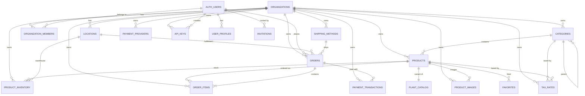

# Junglefy Module & Datenbank-Diagramm

Dieses Diagramm zeigt, wie die Hauptmodule und Datenbank-Tabellen voneinander abhängen.

## Modul-Übersicht

```mermaid
graph TB
  subgraph Auth["Auth (Supabase Auth)"]
    auth_users["auth.users"]
  end

  subgraph Org["Organization"]
    organizations["organizations"]
    locations["locations"]
    members["organization_members"]
    invitations["invitations"]
  end

  subgraph Access["Access"]
    api_keys["api_keys"]
    usage["api_key_usage_log"]
  end

  subgraph Catalog["Catalog"]
    categories["categories"]
    products["products"]
    plant_catalog["plant_catalog"]
    product_images["product_images"]
  end

  subgraph Inventory["Inventory"]
    product_inventory["product_inventory"]
  end

  subgraph Orders["Orders"]
    orders["orders"]
    order_items["order_items"]
  end

  subgraph Shipping["Shipping"]
    shipping_methods["shipping_methods"]
  end

  subgraph Taxes["Taxes"]
    tax_rates["tax_rates"]
  end

  subgraph Payments["Payments"]
    payment_providers["payment_providers"]
    payment_transactions["payment_transactions"]
  end

  auth_users -->|profile| user_profiles["user_profiles"]
  auth_users -->|member| members
  auth_users -->|invited_by| invitations
  auth_users -->|created_by| api_keys
  auth_users -->|customer| orders
  auth_users -->|favorites| favorites["favorites"]

  organizations -->|has| locations
  organizations -->|has| members
  organizations -->|has| invitations
  organizations -->|has| api_keys
  organizations -->|owns| categories
  organizations -->|owns| products
  organizations -->|owns| favorites
  organizations -->|owns| product_inventory
  organizations -->|owns| product_images
  organizations -->|owns| shipping_methods
  organizations -->|owns| tax_rates
  organizations -->|owns| payment_providers
  organizations -->|owns| orders
  organizations -->|owns| order_items
  organizations -->|owns| payment_transactions

  categories -->|parent| categories
  categories -->|contains| products
  categories -->|taxed_by| tax_rates

  products -->|variant_of| plant_catalog
  products -->|in_category| categories
  products -->|stock| product_inventory
  products -->|images| product_images
  products -->|favorite| favorites
  products -->|line_item| order_items
  products -->|taxed_by| tax_rates

  locations -->|warehouse_for| product_inventory
  locations -->|fulfillment_for| orders

  shipping_methods -->|used_by| orders

  orders -->|contains| order_items
  orders -->|paid_with| payment_transactions
```

## Entity-Relationship-Diagramm (vereinfacht)

## Wichtige Verknüpfungsmuster

- **Multi-Tenancy:** Fast jede Tabelle hält ein `organization_id` als Tenant-Isolation.
- **Benutzer & Rollen:** `auth.users` ist die Identität; `organization_members` verknüpft sie mit Rollen (`organization_owner`, `location_owner`, `location_member`, `customer`).
- **Katalog:** `categories` → `products` → `plant_catalog` / `product_inventory` / `product_images`.
- **Bestellung:** `orders` → `order_items` → `products`; Steuer & Versand werden aus `tax_rates` / `shipping_methods` aufgelöst.
- **Zahlung:** `payment_providers` speichert Konfiguration; `payment_transactions` speichert tatsächliche Transaktionen zu einer `order`.
- **API-Zugriff:** `api_keys` gehört zur Organisation; `api_key_usage_log` protokolliert Aufrufe.

## Farblegende (Modul-Ebenen)

| Farbe | Bedeutung |
|-------|-----------|
| **Organization** | Mandant und Mitgliedschaft |
| **Access** | API-Keys, Audit-Log |
| **Catalog** | Produktdaten, Kategorien, Pflanzenkatalog |
| **Inventory** | Lagerbestände pro Location |
| **Orders** | Bestellungen und Positionen |
| **Shipping** | Versandmethoden und Kosten |
| **Taxes** | Steuersätze (global, pro Kategorie oder Produkt) |
| **Payments** | Zahlungsanbieter und Transaktionen |
